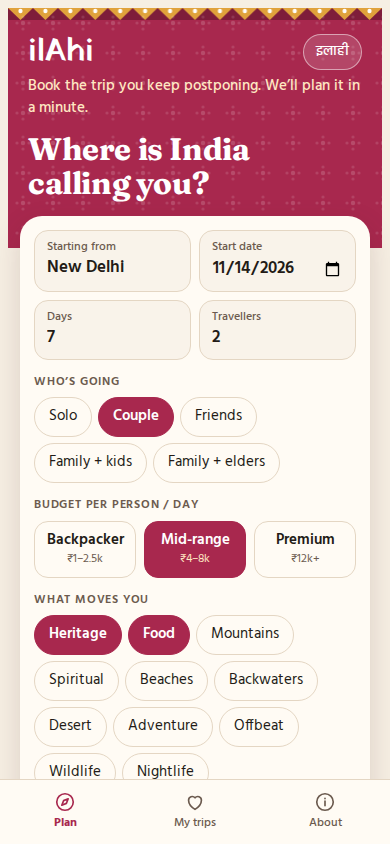
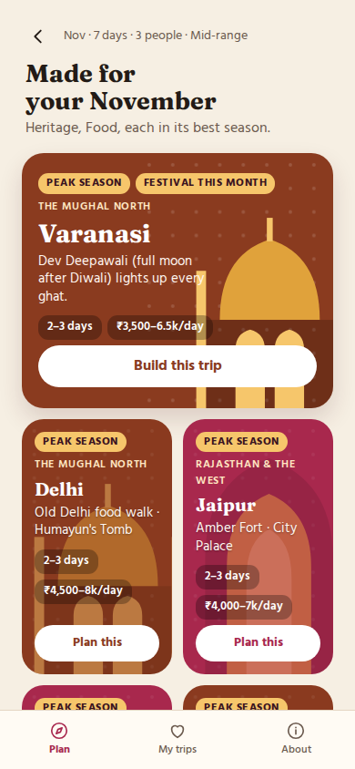
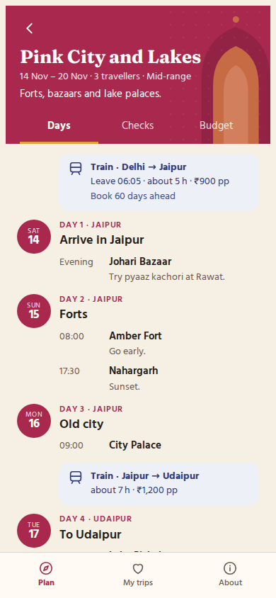
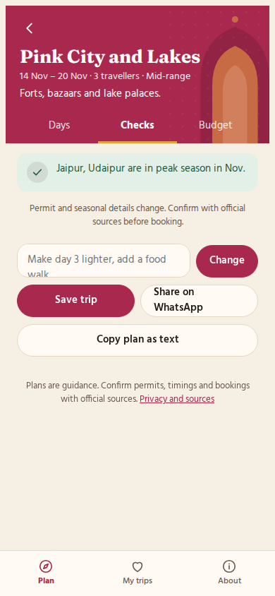

# ilAhi · India trip planner

Plan an India trip that works on the ground: the right season, realistic train and road times, the permits you'll need and the closure days to avoid, with a budget in rupees.

**Try it:** https://bhawankey007.github.io/ilahi/

<p>
  
  
  
  
</p>

## What it does

1. **Suggests where to go** for your month, interests, group and budget, and skips places in their off season.
2. **Writes a day-by-day plan** with an AI planner, grounded in ilAhi's own travel data.
3. **Checks every plan** before you see it. If the AI breaks a rule, it's asked to fix the plan.
4. **Estimates the budget** per person and for the group.
5. **Lets you tweak it** in plain words ("make day 3 lighter"), then save it on your device, share it on WhatsApp or copy it as text.

### The checks

| Check | Example |
|---|---|
| Closure days | The Taj Mahal is closed on Fridays, including on a travel day out of Agra |
| Seasons | Goa in July, Varanasi's ghats in the monsoon |
| Road closures | Manali → Leh by road in January |
| Permits by passport | Inner Line Permit for Arunachal (Indian), Protected Area Permit (foreign) |
| Altitude | No Khardung La on arrival day in Leh |
| Travel times | A 7-hour Delhi → Manali drive gets corrected to 12–14 h |
| Pace and fit | Packed travel days, too-short stays, Spiti with elderly parents |

## How it works

```
site/              the web app (plain HTML, CSS and JavaScript, no build step)
  engine.js        the rules engine: suggestions, checks, budget. No AI, no network.
  planner.js       builds the AI prompt and cleans the AI's answer
  app.js           screens and the AI provider chain
  data/            the travel knowledge base (JSON)
worker/            Cloudflare Worker that talks to Gemini for the public site
tests/             engine, planner and Worker tests
scripts/           data validator and the Claude artifact build
```

The app picks its AI planner in this order:

1. **Inside Claude:** when ilAhi runs as a Claude artifact, plans are written by the viewer's own Claude account.
2. **On the website:** plans come from the ilAhi Worker, which calls Google's Gemini (free tier). The Worker builds the prompt itself from a structured request, so it can't be used as a general AI proxy, and it holds the API key so the key never reaches the browser.
3. **Neither available:** ilAhi builds a starter plan from its own data. The site never stops working.

## Run it locally

You need [Node.js 22](https://nodejs.org) or newer.

```bash
npm run check     # validate the travel data and run all tests
npm start         # serve the site at http://localhost:8080
```

Without a Worker configured, the local site builds starter plans. To publish your own copy with AI planning, follow [docs/SETUP.md](docs/SETUP.md).

## Travel data

ilAhi currently covers 20 destinations, 24 routes and 23 local rules across every region. The data is hand-curated, and 16 rules are marked `"verify": true` because permits and seasonal openings change year to year.

**Found something wrong?** [Report it](https://github.com/BhawanKey007/ilahi/issues/new?template=wrong-info.yml) with a source, or fix it yourself: see [CONTRIBUTING.md](CONTRIBUTING.md).

## Privacy

No accounts, cookies or analytics. Saved trips stay in your browser. On the public site, the trip details you enter are sent to Google's Gemini to write the plan; details are in [docs/PRIVACY.md](docs/PRIVACY.md).

## Disclaimer

Plans are guidance, not bookings. Travel times, prices, permits and seasonal closures change. Confirm with official sources and operators before you travel.

## Licence

[MIT](LICENSE)
